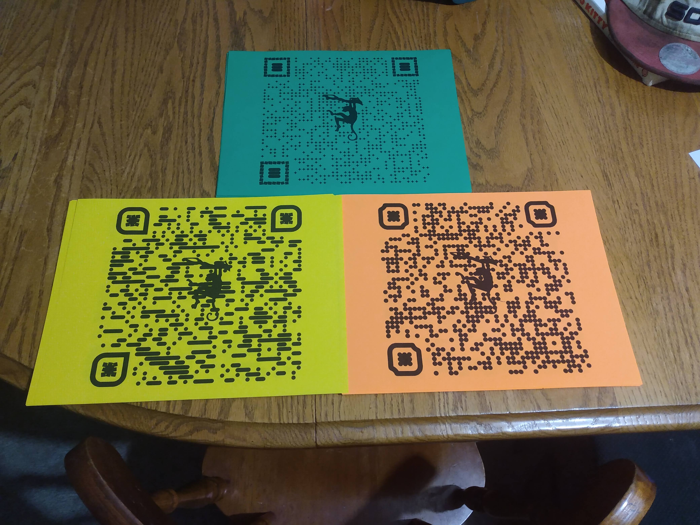

This project was bootstrapped with [Create React App](https://github.com/facebook/create-react-app).

------------------------------------------------------------------

Jungle-Manji was built as a crazy idea project for a cast bonding day for a children's production of the Jungle Book. 
The app is fairly simple and features different cards rendered through a switch with react-router-dom. The navigation is then intentionally hidden to prevent simply clicking on cards at the top. The only way participants were able to get to the cards was by scanning cleverly placed QR Codes in real life. 

-------------------------------------------------------------------
Recommended to Get Started: 

Knowledge of React, create-react-app, and react-router-dom -- this project is hosted through Heroku 

-----------------------------------------------------------------
Needed: 

React, react-router-dom, and IDE for code editing 

-----------

A few cards from the game and the QR Codes: 

</img>

</img>

</img>

</img>